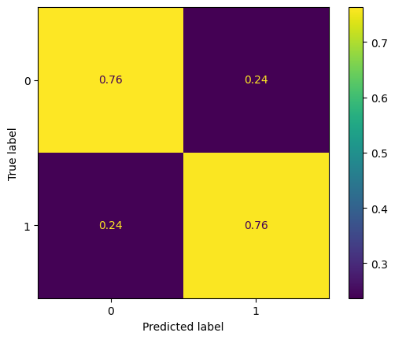

# Deep Learning Approaches to Multi-modal Wearable Biomedical Device (ANNE-One) Sleep Staging
Code repository supporting research in deep learning approaches for multi-modal wearable biomedical device sleep staging. Courtesy of Sunnybrook Research Institute &amp; The teaching teams of CSC413/2516+PHY408 @ UofT.

# How to use this branch
To start the training, use
`sbatch job.sh`

To monitor the status of this job, use
`sq`

## Performing Inference
### Data Format
Please prepare your input data in `.edf` format with the following specifications:

| Channel Index | Signal                     | Sample Rate (Hz) |
|---------------|----------------------------|------------------|
| 2             | Processed (cleaned) ECG    | 100              |
| 5             | Filtered PPG               | 100              |
| 7, 8, 9       | x, y, z -axis Acceleration | 100              |
| 10            | Chest Temperature          | 100              |
| 11            | Limb Temperature           | 100              |
| 17            | PAT (Pulse Arrival Time)   | 100              |
| 21            | HR (Heart Rate)            | 100              |
| 22            | SpO2                       | 100              |
| 23            | RR (Respiration Rate)      | 100              |

Please note that the particular units for each channel does not matter for the model normalizes all signals upon preprocessing.

### Usage
First, install all required python libraries with:
`pip install -r requirements.txt`

To run inference:
`python inference.py -l /path/file1.edf,path/file2.edf -d /path/dir_containing_edf_files`

This will generate a corresponding `.csv` file for each `.edf` file passed in as above in the project directory. 
If you want to save the outputs somewhere else, use the `-o` flag to specify the output directory.

All flags:\
`-l /path/file1.edf,path/file2.edf`: list of paths to individual `.edf` files to run inference on, separated by comma\
`-d /path/dir_containing_edf_files`: path to a directory containing a collection of `.edf` files to run inference on\
`-o /path/dir_to_dump_output_files`: the directory to dump all output files, defaults to `./`
\
`-c {2, 3}`: use this flag to control whether to perform Wake-Sleep 2-class inference or Wake-NREM-REM 3-class inference.
\
`-v`: add this flag if you want an accompanying `.png` file to visualize the outputs.

### Output Format
The output `.csv` will contain a single column of integers in {0, 1, 2}, where 0 := Wake, 1 := NREM, and 2 := REM.
Sequentially every integer entry corresponds to the sleep stage prediction for each consecutive 30s window of the input time series aligned to the start of the file.
The remainder datapoints at the end of the file that have a sequence length shorter than 30s is discarded.

## Preliminary Results
### v1 Dataset
Approaches and results for the v1 dataset documented in detail in [`/results/dataset_v1_results.pdf`](./results/dataset_v1_results.pdf).

### v2 Dataset
#### Binary Sleep-Wake

#### 3-class REM-NREM-Wake

